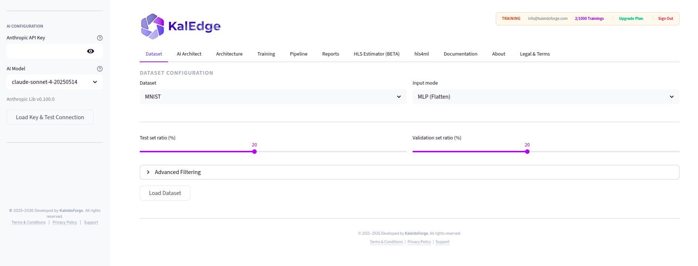

# KalEdge: AI Optimization and Deployment for FPGAs

KalEdge is an advanced machine learning platform designed to bridge the gap between high-level Deep Learning model design and efficient hardware (FPGA) implementation. Powered by **hls4ml**, KalEdge adds layers of automation, AI-assisted optimization, and remote hardware synthesis workflows to make Edge AI accessible to software engineers and hardware designers alike.

Official Cloud Platform: [kaledge.kaleidoforge.com](https://kaledge.kaleidoforge.com)  
Documentation Portal: [GitHub Repository](https://github.com/kaleidoforge/kaledge)

<p align="center">
  
</p>

---

## Key Capabilities

*   **Code-Free HLS Synthesis:** Go from a Keras/QKeras model to a fully synthesizable C++ Vivado HLS project with optimized reuse factors and precision in just a few clicks.
*   **AI Architect & Advisor:** Leverage session-local LLM agents (powered by Anthropic Claude under a Bring Your Own Key model) to design optimized hardware-ready architectures and receive strategic advice.
*   **Comprehensive Compression Suite:**
    *   **Pruning & Quantization Aware Training (QAT):** Minimize weight density and bitwidths using TensorFlow Model Optimization Toolkit (TF-MOT) and QKeras.
    *   **Quantization-Aware Pruning (QAP):** Jointly prune and quantize weights simultaneously to maximize silicon efficiency without accuracy degradation.
    *   **Knowledge Distillation (KD):** Compress complex neural networks into ultra-lightweight "Student" models optimized for silicon.
    *   **Low-Rank Factorization (SVD):** Decompose dense layers to save resources.
    *   **Preset Optimization Pipelines:** Execute pre-established compression combinations (such as *KD -> Pruning -> QAT* or *SVD -> QAP*) with a single click to find the optimal balance of accuracy, memory, and FPGA area.
*   **Resource Estimation (beta) & Simulation:** Predict board-level resource occupancy (LUTs, DSPs, FFs, BRAMs) against hardware constraints with graphical radar indicators before launching synthesis.

---

## Directory Structure

```text
kaledge/
├── LICENSE                    # Apache 2.0 open-source license with cloud SaaS protection clauses
├── README.md                  # Main entry point and platform overview
│
├── docs/                      # Technical manuals and guides
│   ├── getting-started.md     # Step-by-step introduction to the cloud platform
│   ├── dataset-format.md      # Detailed specifications for custom CSV and image datasets
│   ├── qkeras-quantization.md # Best practices for QKeras layers and hls4ml integration
│   └── build-agent-setup.md   # Setup guide for local/remote Vivado Build Agents
```

---

## Getting Started

1.  **Register:** Create your account at [kaledge.kaleidoforge.com](https://kaledge.kaleidoforge.com) (Choose from Hobbyist, Supporter, Developer, or Pro tiers).
2.  **Upload Datasets:** Upload your data in a supported `.csv` format (see [Dataset Format Guide](docs/dataset-format.md)) or load native datasets (MNIST, CIFAR-10).
3.  **Configure AI Architect:** If you are on the **Supporter** tier or higher, enter your Anthropic API Key in the sidebar to unlock conversational network design.
4.  **Train & Compress:** Establish your baseline accuracy ceiling, run knowledge distillation, prune redundant weights, and quantize the model down to custom bit precision.
5.  **Estimate Resources:** Use the **Surrogate Resource Estimator** (currently in Beta and under testing) to predict hardware occupancy (LUTs, DSPs, FFs, BRAMs) against hardware constraints before launching synthesis.
6.  **Simulate & Synthesize:** Convert the model using the **hls4ml** tab, verify bit-accurate simulation results, and export your synthesizable HLS project (with optional **AXI4-Stream / DMA** IP wrapper support). Automatic Bitstream synthesis via the local Build Agent is currently under development for Pro accounts.


---

## Licensing

The scripts, documentation, and tools in this repository are open-sourced under the **Apache License 2.0**. 

*Please note that this license **does not** apply to the core KalEdge Cloud Platform SaaS backend, its databases, or its proprietary cloud dashboard, which remain closed-source commercial assets of KaleidoForge.* See the [LICENSE](LICENSE) file for complete scope details.

---
*© 2025–2026 KaleidoForge | Lightning Bridges for Fast AI*