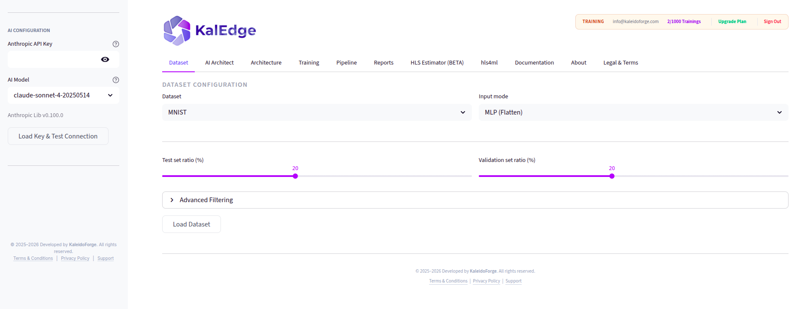

# KalEdge: AI Optimization and Deployment for FPGAs

KalEdge is a platform designed to bridge the gap between high-level Deep Learning model design and efficient hardware (FPGA) implementation. Powered by **hls4ml**, KalEdge adds layers of automation, AI-assisted optimization, and remote hardware synthesis workflows to make Edge AI accessible to software engineers and hardware designers alike.

Official Cloud Platform: [kaledge.kaleidoforge.com](https://kaledge.kaleidoforge.com)  
Documentation Portal: [GitHub Repository](https://github.com/kaleidoforge/kaledge)

<p align="center">
  
</p>

---

## Key Capabilities

*   **Code-Free HLS Synthesis:** Go from a Keras/QKeras model to a fully synthesizable C++ Vivado HLS project with optimized reuse factors and precision in just a few clicks.
*   **AI Architect:** Leverage a session-local LLM agent (powered by Anthropic Claude under a Bring Your Own Key model) to design optimized hardware-ready architectures.
*   **Comprehensive Compression Suite:**
    *   **Pruning & Quantization Aware Training (QAT):** Minimize weight density and bitwidths using TensorFlow Model Optimization Toolkit (TF-MOT) and QKeras.
    *   **Quantization-Aware Pruning (QAP):** Jointly prune and quantize weights simultaneously to maximize silicon efficiency without accuracy degradation.
    *   **Knowledge Distillation (KD):** Compress complex neural networks into ultra-lightweight "Student" models optimized for silicon.
    *   **Low-Rank Factorization (SVD):** Decompose dense layers to save resources.
    *   **Preset Optimization Pipelines:** Execute pre-established compression combinations with a single click.
*   **hls4ml Integration:** Convert and export synthesizable HLS projects with optional AXI4-Stream / DMA IP wrapper support.

---

## Open-Core Model

KalEdge follows an **Open-Core** distribution strategy:

| Tier | Distribution | Auth | Features |
|---|---|---|---|
| **Community** | Docker image (this repo) | Supabase account (free) | Full compression suite, AI Architect (BYOK), hls4ml export |
| **Pro / Corp** | Institutional delivery | Hardware-bound license | All Community features + FPGA estimators, Build Agent, AI Advisor |

---

## Running KalEdge Community (Docker)

The Community edition is distributed as a Docker image. It requires a free account at [kaledge.kaleidoforge.com](https://kaledge.kaleidoforge.com) to log in.

### Pull and run

```bash
docker pull ghcr.io/kaleidoforge/kaledge-community:latest

docker run -p 8080:8080 ghcr.io/kaleidoforge/kaledge-community:latest
```

Then open your browser at `http://localhost:8080` and log in with your KalEdge account.

---

## Getting Started

1.  **Register:** Create your free account at [kaledge.kaleidoforge.com](https://kaledge.kaleidoforge.com).
2.  **Run the image:** Pull and run the Docker image as shown above.
3.  **Upload Datasets:** Upload your data in a supported `.csv` format (see [Dataset Format Guide](docs/dataset-format.md)) or load native datasets (MNIST, CIFAR-10).
4.  **Configure AI Architect:** Enter your Anthropic API Key in the sidebar to unlock conversational network design.
5.  **Train & Compress:** Establish your baseline accuracy, run knowledge distillation, prune redundant weights, and quantize the model down to custom bit precision.
6.  **Export:** Convert the model using the hls4ml tab and download your synthesizable HLS project.

---

## Directory Structure

```text
kaledge/
├── Dockerfile                 # Community image build definition
├── LICENSE                    # AGPL-3.0 open-source license
├── README.md                  # Main entry point and platform overview
│
├── .github/workflows/         # CI/CD for automated Docker image publishing
├── docs/                      # Technical manuals and guides
├── examples/                  # Example datasets and notebooks
└── tools/                     # Utility scripts
```

---

## Licensing

This repository is open-sourced under the **GNU Affero General Public License v3.0 (AGPL-3.0)**.

This means you are free to use, modify, and distribute this software, but any modified version used to provide a network service must also be released under the same license.

*Please note that this license **does not** apply to the KalEdge Pro/Corp platform, its proprietary estimators, build servers, or enterprise delivery assets, which remain closed-source commercial products of KaleidoForge.* See the [LICENSE](LICENSE) file for complete scope details.

---
*© 2025–2026 KaleidoForge | Lightning Bridges for Fast AI*
